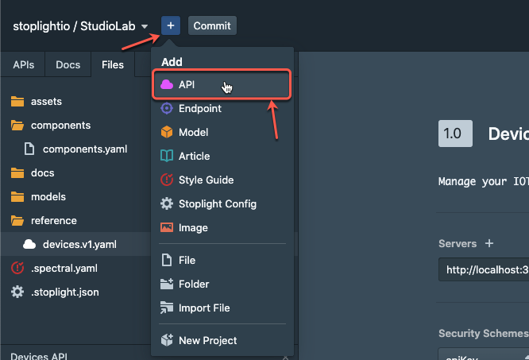
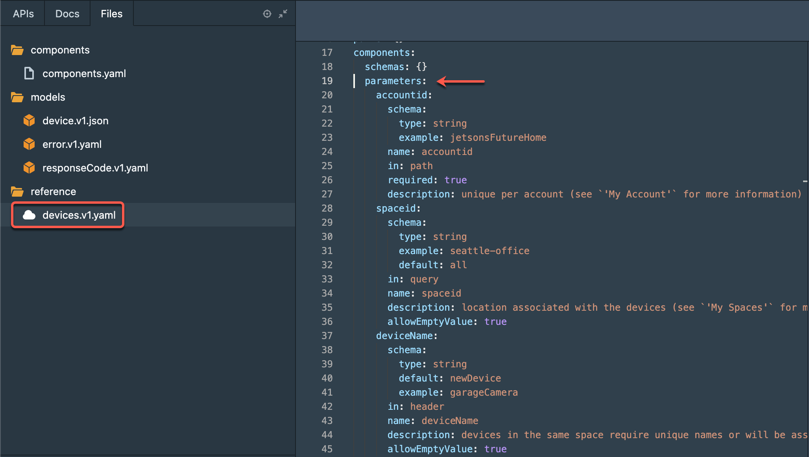

# Create an API

You will notice that your APIs tab is pretty empty besides a few model files we provided to you. Let's change that!

<!-- theme: warning -->

> ### Create your own Branch!
>
> _Make sure that you first checkout the `starter` branch but then create a new branch to complete the exercises. Call it whatever you want!_

### Add an OAS file

Start by adding a new API by clicking on the blue plus `(+)` icon on the top left of the UI.



Create an API called 'devices', using `OpenAPI v3` and `YAML` format.


### API Overview

Once you added the `devices.v1.yaml` API file, you will be presented with an empty overview page. Use the form editor to do the following:

- [x] Write a neat **Description** (right below the **Title**).
- [x] Add an API token in **Security Schemes** to secure your methods.
- [x] Add **Contact** information so your docs consumers know who to talk to.
- [x] Include licensing information so users know how you **License** your API.


<!-- theme: info -->

> ### Pro Tip...
>
> *Now would be a great time to push changes to your new branch to make sure that your progress is saved.*

### Reusable Parameters

To end this section you will need to add a set of parameters to the components section of your `devices.v1.yaml` file. To do so change the view from `form` to `code` and look at the underlying yaml for your API description.

Notice the arrow indicating a section called `components` which contains schemas and security schemes. We will want to add a few parameters to this section as we will reuse them through out the document.


Copy the following set of parameters written in `yaml`:

```yaml
parameters:
    accountid:
      schema:
        type: string
        example: jetsonsFutureHome
      name: accountid
      in: path
      required: true
      description: unique per account (see `'My Account'` for more information)
    spaceid:
      schema:
        type: string
        example: seattle-office
        default: all
      in: query
      name: spaceid
      description: location associated with the devices (see `'My Spaces'` for more information)
      allowEmptyValue: true
    deviceName:
      schema:
        type: string
        default: newDevice
        example: garageCamera
      in: header
      name: deviceName
      description: devices in the same space require unique names or will be assigned the default name `'newDevice'`
      allowEmptyValue: true
    deviceid:
      schema:
        type: string
        default: all
        example: 123abc
      in: header
      name: deviceid
      description: 'unique identifiers for devices registered on the service cloud, when empty it defaults to `''all''`'
      allowEmptyValue: true
      required: true
    sort:
      schema:
        type: string
        enum:
          - asc
          - desc
        default: desc
        example: asc
      in: query
      name: sort
      allowEmptyValue: true
      description: will sort objects returned from the request
    limit:
      schema:
        type: integer
        default: 10
        format: int32
        example: 15
        maximum: 25
        minimum: 1
      in: query
      name: limit
      allowEmptyValue: true
      description: specify the number of results returned from the request

```
Paste this content right below `schemas: {}` and above `securitySchemes:` as shown here :



(`yaml` cares about indentation so make sure that `parameters` aligns with `schemas: {}`)

<!-- theme: warning -->

> ### Security Schemes
>
> _Before proceeding to the next step make sure that you did not delete the _`securitySchemes:`_ object by mistake! Additionally **Studio** will warn you if your yaml file has invalid syntax due to incorrect indentation._

<!-- theme: success -->

> ### Well Done!
>
>*Once you are done with this section you will need to create a few more models to use as request and response bodies for your endpoints. Continue to the section called '**Models**'.*
